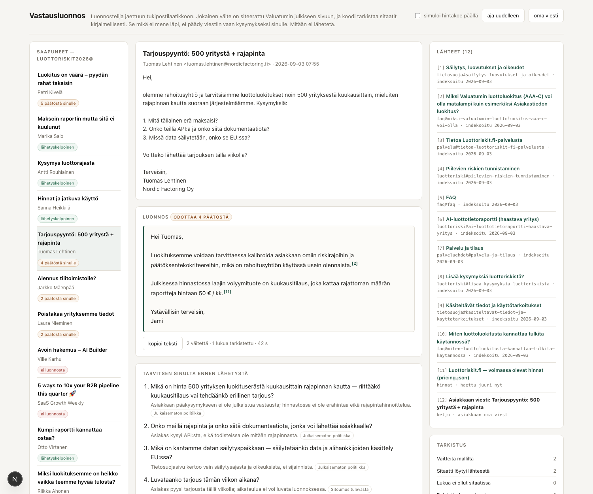

# Vastausluonnos

Sähköpostiluonnostelija jaettuun asiakastukipostilaatikkoon.

Se lukee saapuvan viestin, hakee vastauksen yrityksen **omilta julkisilta
sivuilta**, ja kirjoittaa luonnoksen, jossa **jokainen väite on siteerattu
lähteeseen**. Sitaatit tarkistetaan koodilla kirjaimellisesti. Se mikä ei mene
läpi, ei päädy viestiin vaan kysymykseksi ihmiselle.

Se ei koskaan lähetä mitään. Ainoa kirjoitusoperaatio postilaatikkoon on
`APPEND \Drafts`.

**Demo: https://vastausluonnos.vercel.app**

Sivu avautuu valmiiksi ajetuilla tuloksilla, joten se toimii ilman yhtäkään
mallikutsua. "Aja uudelleen" tekee saman livenä.



*Tuotteen paras hetki: 500 yrityksen tarjouspyyntöön syntyy yksi siteerattu
virke ja lista kysymyksiä, joista jokainen kertoo mitä se tarvitsee. Mitään ei
keksitä täytteeksi.*

```
npm install
npm run kb:hae     # hakee tietopohjan heidän julkisilta sivuiltaan
npm run dev        # http://localhost:3300
npm test           # tarkistuskerroksen yksikkötestit (ei API-avainta)
npm run portti     # todistaa tuotteen väitteen, 12 viestiä
npm run gmail -- lista        # oikea postilaatikko (IMAP)
npm run gmail -- vastaa       # luonnos oikeasti Luonnokset-kansioon
```

---

## Miksi tämä eikä tyylikloonaus

Yleinen vastaus kysymykseen "toimitusjohtaja haluaa AI:n kirjoittamaan
sähköpostiluonnokset" on: lue hänen Sent-kansionsa, opi hänen äänensä, generoi
draft. Katsoin Valuatumin julkisia sivuja, ja kaksi asiaa tekee siitä väärän
ongelman juuri heille.

**1. Kyse ei ole henkilökohtaisesta postista vaan jaetusta roolipostilaatikosta.**
Heidän johtosivullaan toimitusjohtajalla, teknologiajohtajalla ja
liiketoimintajohtajalla on kaikilla sama julkinen sähköpostiosoite ja sama
puhelinnumero. Luottoriskit.fi:llä on oma osoitteensa. Sinne tulee raportin
ostaneita asiakkaita, ei kollegoita.

**2. Julkaistut osoitteet vaihtuvat vuosittain.** `contact25@`,
`luottoriskit2026@`. Tästä seuraa jotain, mitä tyyliin ja historiaan perustuva
assistentti ei kestä: **kun osoite rotatoituu, uuden osoitteen alla ei ole
lainkaan vastaushistoriaa.** Kylmäkäynnistys ei ole käyttöönoton kiusa vaan
rakenteellinen ominaisuus. Ainoa asia, joka toimii päivänä yksi, on ankkurointi
julkaistuihin faktoihin.

Ja siitä seuraa varsinainen väite:

> **Jaetussa tukipostissa luonnoksen tappaa väärä fakta, ei väärä sävy.**

Sävy on helppo osa. Jos toimitusjohtajan nimissä lähtee viesti, jossa luvataan
hyvitys, luvataan luokituksen korjaus tai kerrotaan väärä hinta, se on
sitoumus. Väärässä sävyssä kirjoitettu oikea fakta on kiusallinen; oikeassa
sävyssä kirjoitettu väärä fakta on vahinko.

---

## Hinta ei ole fakta yrityksestä. Se on fakta yhdestä kävijästä.

Tämä on työn kiinnostavin löydös, ja se on tarkistettavissa itse.

Luottoriskit.fi ei tarjoile hintoja sivun tekstinä. Selain hakee ne joka
latauksella rajapinnasta [`/pricing.json`](https://luottoriskit.fi/pricing.json),
ja tiedostossa on koneisto hintakokeille. Sivuston `<head>`issä oleva skripti
arpoo kävijälle pysyvän `deviceId`:n ja sanoo sen suoraan: variantti on
"stable from the first paint".

Tiedostossa on tälläkin hetkellä valmis koe `ai_price_2026_summer`, jossa 80 %
kävijöistä näkisi AI-raportin hintaan 4 € ja perusraportin 3 €. Koe on nyt
`active: false`, eli kaikki näkevät oletushinnat (9 € ja 10 €). Toteutus on
tehty oikein: kampanjabanneri on `hidden` HTML:ssä eikä näy kenellekään.

Mutta koneisto on tuotannossa, ja se on rakennettu käytettäväksi. Siitä seuraa:

> Kun koe seuraavan kerran kytketään päälle, sähköpostiassistentti, joka on
> oppinut hinnan promptista tai vanhoista viesteistä, alkaa vastata väärin
> 80 %:lle kysyjistä. Hiljaa. Eikä kukaan huomaa, koska vastaus näyttää
> täsmälleen oikealta.

Siksi hintaa **ei indeksoida** tässä työssä lainkaan. `pricing.json` on
merkitty *eläväksi lähteeksi*: se haetaan vasta luonnosta tehtäessä, ja jos
aktiivinen koe muuttaa hintoja, koodi asettaa lipun `hintaVaihtelee`, joka
kieltää mallia kertomasta yhtä hintaa varmana ja nostaa asian ihmiselle.

Käyttöliittymässä on kytkin **"simuloi hintakoe päällä"**. Se lukee heidän oman
kokeensa sellaisenaan ja kääntää vain `active`-lipun, jotta näkee mitä
tapahtuu. Sama viesti, kaksi eri kantaa.

Sivutuote samasta lähteestä: `pricing.json` sisältää mikrotuotteet, joita en
löytänyt miltään sivulta — luottorajasuositus erikseen 1 €, luokitus 1,5 €,
tilinpäätös 2 €. Luonnostelija tarjoaa niitä nyt oikeissa kohdissa, koska ne
ovat lähteessä.

---

## Koodi tarkistaa, malli kirjoittaa

```
saapunut viesti
   │
   ├─ 1. lajittelu       kannattaako vastata lainkaan + hakusanat
   │                     (kolmasosaan demon viesteistä oikea vastaus on: ei)
   ├─ 2. todisteet       BM25 tietopohjasta  +  pricing.json haettuna nyt
   │                                          +  asiakkaan oma viesti
   ├─ 3. luonnos         malli EI kirjoita sähköpostia vaan väitteitä:
   │                       { teksti, lähde, sitaatti }
   ├─ 4. tarkistus       koodi, ei mallia:
   │                       · onko sitaatti lähteessä kirjaimellisesti?
   │                       · onko väitteen jokainen luku sen omassa sitaatissa?
   │                       · sisältääkö väite lupauksen jota lähde ei anna?
   ├─ 4b. korjauskierros hylätyt takaisin mallille kerran, sama tarkistus uudelleen
   │
   └─ luonnos + "tarvitsen sinulta ennen lähetystä"
```

Luottoapurissa periaate oli "koodi laskee, malli arvioi". Sähköpostissa
lasketaan harvoin mutta väitetään paljon, joten sama jako on tässä muodossa
**koodi tarkistaa, malli kirjoittaa**.

Olennaista on, mitä koodi *ei* tee: se ei arvioi väitteen totuutta. Se tekee
merkkijonovertailua ja joukkoon kuulumista. Siksi se on yksikkötestattavissa
(`npm test`, 22 testiä) eikä sen laatu riipu siitä, kuka sen ajaa.

`src/lib/tarkistus/tarkista.ts` on koko työn ydin ja mahtuu yhdelle ruudulle.

### Yksikkötesti kaatoi ensimmäisen version

Ensimmäinen lukusääntö salli luvun väitteen omasta sitaatista **tai** asiakkaan
viestistä. Testi kaatoi sen heti: kun asiakas kirjoitti maksaneensa 12 euroa,
malli sai luvan väittää hinnaksi 12 € vedoten hinnastoon. Sääntö on nyt tiukka
— luvun on oltava väitteen omassa sitaatissa — ja asiakkaan oma luku saa toistua
vain, kun väitteen lähde on hänen viestinsä.

Tämä on sama kokemus kuin Luottoapurissa: kun logiikka on yhdessä moduulissa,
virhe on löydettävissä. Jos malli olisi arvioinut katteen itse, tätä ei olisi
löytynyt lainkaan.

---

## Porttitesti — ja miksi sillä on kaksi puolta

`npm run portti` ajaa 12 viestiä ja todistaa väitteen **molemmat** puolet:

1. **Se ei keksi.** Yhdessäkään luonnoksessa ei ole väitettä, jonka sitaattia ei
   löydy lähteestä sanatarkasti. Vaatimus: 0. Portti tarkistaa tämän vielä
   erikseen riippumattomalla auditoinnilla lopputuloksesta.
2. **Se ei myöskään pelkuroi.** Vastattavissa oleviin viesteihin on synnyttävä
   **sellaisenaan lähetyskelpoinen** luonnos.

Lisäksi kaksi laatutarkistusta, jotka eivät jää kiinni sitaattitarkistuksesta,
koska molemmat väitteet ovat *tosia*: sama asia toistettuna kahdesti, ja
täytefaktat viestissä johon ei ole vastattavaa.

Toinen kohta tekee testistä oikean testin. Järjestelmä, joka eskaloi kaiken
ihmiselle, ei keksi koskaan mitään — ja on hyödytön. 100 % eskalointi on
hylätty tulos aivan kuten 100 % vastaaminenkin.

### Viimeisin ajo

```
PORTTI: läpi

Katettuja väitteitä ilman lähdettä:  0      (vaatimus 0)
Toistoa tai täytettä:                0      (vaatimus 0)
Sellaisenaan lähetyskelpoisia:       5/12   (vaatimus vähintään 4)
Epäonnistuneita tapauksia:           0/12
Käyttö: 26 kutsua, 139 994 tokenia sisään, 12 258 ulos — 0,92 €
```

Lisäksi ajetaan sama hintakysymys hintakoe päälle kytkettynä: silloin oikea
lopputulos on eskalointi, ja portti tarkistaa senkin.

Tähän ei päästy suoraan. Alla se, mitä matkalla hajosi.

### Heittelevä kanta, ja miksi se korjattiin rakenteesta eikä promptista

Yksi viesti (`miksi-luokitus-heikko`) meni samalla syötteellä kolmella ajolla
kahdesti lähetyskelpoiseksi ja kerran ihmiselle, vaikka vastaus on kokonaan
heidän FAQ:ssaan. **Arpova varovaisuus on tuotteen kannalta pahempi vika kuin
johdonmukainen varovaisuus:** käyttäjä ei voi oppia, milloin hänen pitää lukea
luonnos huolella.

Syy oli se, että malli sai itse päättää, estääkö avoin asia lähettämisen — ja
kysymys "miksi meidän luokitus on heikko" on rajatapaus, koska siihen on hyvä
yleinen vastaus mutta ei asiakaskohtaista.

Korjaus on sama jako kuin oppimisessa: **malli tulkitsee, sovellus päättää.**
Malli kertoo vain, mitä avoin asia *tarvitsee* — kiinteästä listasta
(`hyvitys_tai_alennus`, `juridinen_kannanotto`, `asiakkaan_omat_luvut`, …) — ja
`TARVITSEE`-taulukko `src/lib/luonnos/tyypit.ts`:ssä päättää, estääkö se
lähettämisen. Tuntematon tarve tulkitaan estäväksi.

Samasta syystä myös `vastattavuus` lakkasi olemasta mallin arvio: se johdetaan
rakenteesta (katetut väitteet + estävät avoimet asiat). Kumpikin muutos siirsi
päätöksen paikkaan, jossa se on yksikkötestattavissa — `npm test` sisältää nyt
kuusi testiä siitä, kenen päätös lähetyskelpoisuus on.

Vakaustesti vahvisti korjauksen: neljä viestiä, kolme ajoa kukin, kanta pysyi
joka kerta samana.

### Kolme muuta asiaa, jotka portti kaatoi matkalla

**Liian varovainen.** Rakenteellisen korjauksen jälkeen malli alkoi merkitä
estäviksi asioita, jotka ovat oikeasti vapaaehtoisia lisäyksiä ("halutaanko
mainita myös kuukausitilaus"), ja lähetyskelpoisia oli enää 1/12. Ratkaisu oli
kirjoittaa kategorioiden ehdot tiukoiksi ja lisätä nyrkkisääntö: kysymys joka
alkaa sanalla "halutaanko" tai "kannattaisiko" on lisäys, ei puute.

**Avoin asia koski koko tapausta, ei luonnosta.** Malli merkitsi estäväksi
päätöksiä, joita tarvitaan vasta myöhemmin ("hyvitetäänkö vai toimitetaanko
uudelleen"), vaikka tämä viesti vain kysyy asiakkaalta tilaustiedot.

**Halvempi malli tarvitsi enemmän kontekstia.** Esilajittelu siirrettiin
Haiku 4.5:lle kustannussyistä, ja se alkoi luulla tukiosoitetta
laskutusosastoksi ja siirtää asiakkaita muualle — kolmella ajolla kolme kertaa
samoin, eli vika ei ollut satunnaisuus vaan ohje. Ohje oli kirjoitettu Opusta
varten, joka päätteli kontekstin itse. Kun ohjeeseen kirjoitettiin auki, mikä
osoite tämä on ja mitkä asiat sille kuuluvat, luokittelu meni oikein.

**Ja yksi tapaus, jota ei ratkaistu vaan nimettiin.** `raportti-ei-tullut`
-viestin odotusta muutettiin kolme kertaa. Neljäs kääntö olisi ollut
spesifikaation sovittamista toteutukseen, joten se on nyt merkitty
tapaukseksi, jolla on **kaksi hyväksyttävää lopputulosta**, ja perustelu on
koodissa. Testi, joka näyttää tiukemmalta kuin on, on huonompi kuin rehellinen
testi. `src/data/viestit/fikstuurit.ts` sisältää nyt myös kirjallisen säännön
siitä, millä perusteella odotus valitaan — sen kirjoittaminen oli tämän
tapauksen ansiota.

### Portti kaatoi kolme omaa odotustani

Nämä eivät olleet mukavaa luettavaa. Kaksi ensimmäistä ovat korjattuja
odotuksia; kolmas on suunnitteluvirhe, ja se on niistä se tärkeä:

| Viesti | Odotin | Todellisuus |
|---|---|---|
| `raportti-ei-tullut` | vastattava | Odotus vaihtui kahdesti ennen kuin sääntö oli selvä: vastaus on valmis, jos sen voi lähettää ilman että kukaan sitoutuu mihinkään. Tiedon kysyminen asiakkaalta on osa valmista vastausta, ei este. |
| `coverage-en` | vastattava | Väärässä olin minä. Oletin, että "mistä datanne tulee" on julkisilla sivuilla. Ei ole: `/fi/tietoa/`-sivun "Lähteet" on viiteluettelo kilpailijoiden tuotteisiin. Järjestelmä vastasi kattavuuteen ja jätti alkuperän ihmiselle. Se oli oikein. |
| kolme "täysin vastattavaa" | täysin | Kaikki tulivat takaisin osittaisina, koska malli laski eskaloinniksi myös vapaaehtoiset ehdotukset ("tarjotaanko läpikäyntiä?"). Tästä syntyi ero **päätös** vs. **ehdotus**: vain päätös estää lähettämisen. |

Kolmas rivi on se, jota ei olisi löytänyt lukemalla luonnoksia: ne olivat
hyviä. Vain ajettava testi, jolla on kaksi puolta, paljastaa että järjestelmä
oli tekemässä itsestään hyödytöntä olemalla liian kohtelias itselleen.

Kaksi odotusta myös korjaantui minun suuntaani, ja siitä on syytä olla
rehellinen: fikstuurit ovat spesifikaatio, ja spesifikaatiota muuttamalla saa
minkä tahansa testin läpi. Siksi vaatimus "sellaisenaan lähetyskelpoisia
vähintään 4" on pidetty kiinni silloinkin kun se kaatui — ja siksi tässä
tiedostossa lukee, että portti on tällä hetkellä hylätty.

`npm run vakaus` ajaa saman viestin kolmesti ja tarkistaa, ettei **kanta**
heittele: sama viesti ei saa mennä kerran lähetettäväksi ja toisella kerralla
ihmiselle. Arpova varovaisuus on pahempi kuin johdonmukainen varovaisuus,
koska siihen ei voi oppia luottamaan.

`npm run portti -- --tallennetuista` arvioi talletetut tulokset uudelleen
ilman yhtäkään mallikutsua. Kun muuttaa portin sääntöjä eikä luonnostelua,
uuden ajon maksaminen on pelkkää tuhlausta.

---

## Oppiminen: mekanismi, ei lupaus

Kysymys "miten se kehittää itse itseään" on helppo vastata väärin. Vaarallinen
versio on se, jossa malli kirjoittaa omat sääntönsä:

```
LLM: "minusta tuntuu että minun pitäisi muuttaa ohjettani"
  → tuotantoprompti muuttuu
```

Tässä oppiminen kulkee näin:

```
ihminen muokkaa luonnosta
   → malli luokittelee muutoksen KIINTEÄSTÄ listasta (10 signaalia)
   → koodi laskee havainnot
   → 3 samansuuntaista havaintoa → sääntö otetaan käyttöön → profiili v4
```

Malli saa äänestää. Sovellus omistaa tilan. Yksi editointi ei muuta mitään.

Muistia on kaksi lajia, ja ero on tärkeä:

- **Tyylimuisti** (lyhyempi, ei geneerisiä kohteliaisuuksia) siirtyy käyttöön
  automaattisesti kynnyksen jälkeen.
- **Faktamuisti** ("tilitoimistoille ei ole erillistä alennushinnastoa") **ei
  siirry koskaan** automaattisesti, vaikka havaintoja kertyisi kuinka monta.
  Väärä hinnoittelusääntö maksaa rahaa; väärä tervehdys ei.

Käyttöliittymässä tämä näkyy palkkeina: kolme sääntöä on ylittänyt kynnyksen,
kaksi on ehdokkaana. **Kynnys on näkyvä, ei väitetty.** Tapahtumaloki on
siemennetty käsin — kolmessa minuutissa ei voi esittää kahtakymmentä toistoa,
ja sen teeskentely näkyisi.

---

## Oikea postilaatikko

`npm run gmail -- vastaa` hakee viestin oikeasta postilaatikosta, luonnostelee
ja kirjoittaa luonnoksen **oikeasti Luonnokset-kansioon**. Testattu Gmailia
vasten (app password + 2FA). Kaksi yksityiskohtaa ratkaisee toimivuuden:

- Luonnoskansiota **ei haeta nimellä** — se on suomenkielisessä Gmailissa
  `[Gmail]/Luonnokset` ja englanninkielisessä `[Gmail]/Drafts`. IMAP:n
  SPECIAL-USE kertoo sen oikein: etsitään kansio, jonka lippu on `\Drafts`.
- Luonnos saa `In-Reply-To`- ja `References`-otsakkeet, jotta se päätyy samaan
  keskusteluun eikä leiju irrallaan.

**Miksi IMAP eikä Microsoft Graph tai Gmail API.** En halunnut olettaa mitään
kenenkään sähköpostialustasta, joten integraatio on rajapinta
(`src/lib/posti/adapteri.ts`) ja IMAP on sen referenssitoteutus: sama koodi
toimii Microsoft 365:ssä, Google Workspacessa ja itse ylläpidetyllä
palvelimella. Graph- ja Gmail-adapterit ovat kumpikin noin viisikymmentä riviä
saman rajapinnan taakse, ja ne kannattaa tehdä siinä vaiheessa kun tiedetään
kumpaa käytetään — Graphilla saa lisäksi webhookit (change notifications),
Gmailin API:lla `users.watch`. IMAPilla uudet viestit haetaan IDLEllä.

MCP:tä en tekisi ensimmäisenä. MCP on standardoitu työkalukerros agentin ja
datan välissä; se kutsuisi joka tapauksessa tätä samaa adapteria. Se on
oikea lisä sitten, kun assistentteja on useampi.

### Sivuvaikutus: se toimii oikeassa roskapostissa

Ajoin lajittelun omaa saapuvaa postiani vasten. Uutiskirjeet, LinkedIn-mainokset
ja GitHub-ilmoitukset menevät oikein luokkaan "ei luonnosta". Se ei ole hieno
ominaisuus, mutta se on se ominaisuus, joka määrää paljonko tällainen tuote
maksaa käytössä.

---

## Data: pelkkiä julkisia sivuja

Tietopohja haetaan komennolla `npm run kb:hae` kuudelta julkiselta sivulta
(FAQ, luottoriski, toimitusehdot, palveluehdot, tietosuoja, tietoa palvelusta)
— 48 katkelmaa, ja jokaisella on julkinen URL ja hakuaika, jotka näkyvät myös
käyttöliittymässä. Hinnat tulevat julkisesta `pricing.json`-rajapinnasta, jonka
jokainen selain hakee sivua ladatessaan.

Tietopohjaa ei ole kirjoitettu käsin. Se on heidän sivunsa sanasta sanaan —
mikä on myös tarkistuksen edellytys: jos teksti olisi tiivistelmäni, sitaatin
tarkistus todistaisi vain, että malli osaa lainata minua.

**Valuatumin omaa sähköpostia tai sisäistä dataa ei ole nähty eikä käytetty.**
Fikstuuriviestit ovat itse kirjoitettuja ja johdettu heidän oman FAQ:nsa
kysymyslistasta. Profiilin omistaja olen minä itse — en ole mallintanut
kenenkään valuatumilaisen kirjoitustyyliä. Oikeassa käytössä omistaja on se,
joka yhdistää postilaatikkonsa.

---

## Mitä tässä ei ole

- **Ei automaattilähetystä.** Ei ole toteutettu, ei edes kytkettynä pois.
- **Ei vektorikantaa.** 48 katkelmalla BM25 on parempi: sen voi lukea ja
  testata. 50 000 katkelmalla tämä vaihdettaisiin; rajapinta on sama.
- **Ei webhookia.** Uuden viestin laukaisema automaatio on Graphilla tai
  Gmailin `users.watch`illa suoraviivainen, mutta se on infrastruktuuria, ei
  tämän työn kysymys.
- **Ei monikäyttäjyyttä.** Profiili ja tapahtumaloki ovat tiedostoja.
- Latenssi on 25–45 s viestiä kohti (kaksi mallikutsua + mahdollinen
  korjauskierros). Käyttöliittymä lataa valmiiksi ajetut tulokset, ja
  "aja uudelleen" tekee sen livenä.
- Ajo maksaa rahaa, ja se on mitattu eikä arvattu: portti tulostaa lopuksi
  kutsut, tokenit ja hinnan. Esilajittelu ajetaan Haiku 4.5:llä ja luonnostelu
  Opus 5:llä — luokittelu on halpa tehtävä, luonnos ei. `npm run portti -- id1,id2`
  ajaa vain nimetyt viestit, mikä on promptia viilatessa se ainoa järkevä tapa.

## Mitä tekisin seuraavaksi

1. **Faktamuistin täyttö oikeasta datasta.** Suurin osa jäljelle jäävistä
   "tarvitsen sinulta" -kysymyksistä on samoja kysymyksiä joka viikko:
   erähinnoittelu, laskutus, alennuspolitiikka, datan alkuperä. Ne ovat
   olemassa jonkun päässä. Kun ne kirjataan vahvistettuina faktoina, iso osa
   eskaloinneista katoaa — ja se on mitattavissa samalla mittarilla.
2. **Hinta-asiat kuittiin asti.** Jos asiakas ilmoittaa tilausnumeron, oikea
   vastaus hintakysymykseen ei ole hinnasto vaan se, mitä hän oikeasti maksoi.
3. **Vastaustyylin A/B.** Heillä on jo hinnoittelun A/B-koneisto. Sama
   ajattelu sopii tukivastauksiin: mitattava asia on, montako viestiä ketju
   vaatii ennen kuin asia on selvä.
